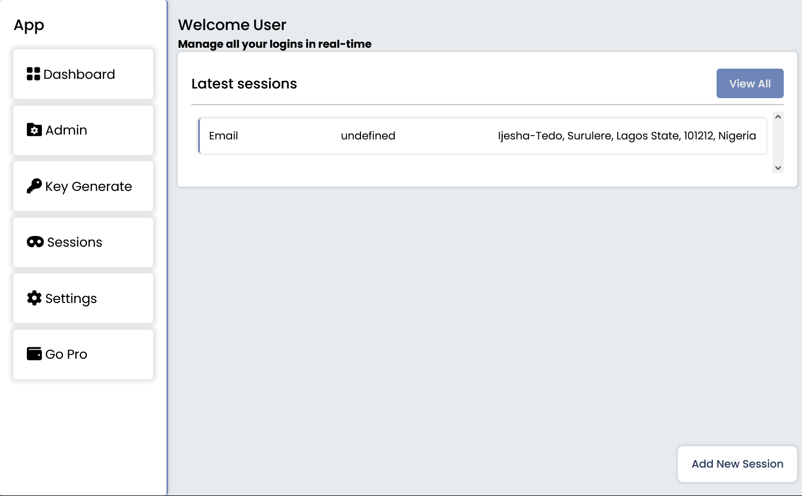

## AuthyWebServiceClient

`AuthyWebServiceClient` is a tool to help you create a new secured token with session authentication.

## Description

An authentication app to store and generate secure tokens for more secure login. Users can add, edit and delete the password in their account anywhere in the world.

## FAQ

*   How does the app work? The app stores tokens and login sessions in a memory address and saves it for next time the user wants to log in
*   How to use the application? To start using the application, you'll need to sign up or login, after creating an account, you'll see a button to create new session, once you created new session with an auth-method, for example using `Google` or `Facebook` you'll get a token that can be generated by you.

## How to validate the token

If you created a recent session with same details, you'll notice you can't create another session because your session already exist on the memory address.

### Make a request

When you add new session or load the dashboard page, you are making a request to our API, our API handles everything that makes the app work.

## How to use the App

*   To get started, you must first have an account with us, to do so create an account using the method that pops up on the app
*   After you've successfully created an account, you must remember to validate your account otherwise it will be deleted with 7 days
*   Once that process is completed you can start adding new session login, also note that when the session page loads you get an example session already added, this is to brief out what's going on here, so you get a better understanding of which information you're giving to us.
*   You can add as many sessions as you want, with no limit.

## Video Guide on How to use App

[]

## Features

*   [x] Multiple Session Login
*   [x] Token Generation
*   [x] Session Rest -using existing token
*   [x] have access to view last time, account was being used

More features are coming soon 👐

---

### 🔐 Providers supported

*   Google
*   Email
*   Facebook
*   Twitter
*   🔜 More coming soon

### 🚨 Disclaimer

We don't store your password, we only store the information that you provide to us.

For Google Auth and other providers seek our [blog](https://github.com)

### More Information

[Discord](https://discord.com)
[Twitter](https://twitter.com)
Website coming soon

> _Made with 💖_